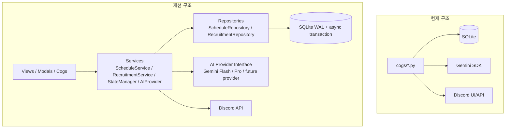

# Team 0x34 Discord Bot

Team 0x34 운영을 위한 `discord.py` 기반 Discord 봇입니다. Slash Commands, Modals, Buttons, Embeds, SQLite를 사용하며 Railway 배포를 바로 시작할 수 있는 구조입니다.

## 디렉토리 구조

```text
0x34-bot/
├── bot.py
├── config.py
├── requirements.txt
├── Procfile
├── .env.example
├── .gitignore
├── cogs/
│   ├── __init__.py
│   ├── schedule.py
│   ├── tournament.py
│   ├── recruitment.py
│   └── maintenance.py
├── services/
│   ├── __init__.py
│   ├── ai.py
│   ├── base.py
│   ├── error_handler.py
│   ├── recruitment.py
│   └── state_manager.py
├── repositories/
│   ├── __init__.py
│   └── base.py
└── utils/
    ├── __init__.py
    ├── ai_input.py
    ├── database.py
    ├── datetime.py
    └── embeds.py
```

## 아키텍처 방향

현재 `cogs/`는 Discord Slash Command, Modal, Button, Select의 진입점으로 유지하고, 신규 비즈니스 로직은 `services/`로 이동합니다. DB 접근은 `repositories/`가 담당하고, 공통 시간/Embed/입력 전처리처럼 순수한 도우미만 `utils/`에 둡니다. 이렇게 두면 일정, 모집, 유지보수 기능이 서로 직접 얽히지 않고 상태 관리자와 저장소 계약을 통해 같은 데이터를 다룹니다.



도입된 기반 인터페이스는 다음과 같습니다.

- `services.base.BaseService`: 서비스 레이어 공통 로깅과 `run_safely()` 실패 격리
- `services.state_manager.StateManager`: `dashboard_state`를 재시작 후에도 복구하는 단일 메시지 상태 관리자
- `services.recruitment.RecruitmentService`: 모집 생성과 작성자 owner 참가자 등록을 하나의 트랜잭션으로 묶고, 모집 조회 시 owner가 포함된 참가자 목록을 보장하는 도메인 서비스
- `services.ai.AIProvider`: Gemini Flash/Pro 또는 다른 모델로 교체 가능한 AI 호출 인터페이스
- `repositories.base.Repository`: `execute/fetch_one/fetch_all` 기반 비동기 저장소 계약
- `services.error_handler.BotErrorHandler`: Slash Command, 텍스트 명령, 이벤트 예외를 중앙 처리하는 graceful degradation 계층

SQLite는 `PRAGMA busy_timeout=5000`, `PRAGMA journal_mode=WAL`을 사용하며, 여러 SQL을 하나의 원자적 작업으로 묶어야 할 때는 `Database.transaction()`을 사용합니다. 일정 정리는 `is_deleted` 기반 soft delete를 기본으로 하며, 일반 조회는 `WHERE is_deleted = 0` 조건을 포함해야 합니다.

## 빠른 시작

1. Discord Developer Portal에서 봇을 만들고 `applications.commands`와 `bot` 스코프로 서버에 초대합니다.
2. `.env.example`을 참고해 Railway Variables 또는 로컬 `.env`를 설정합니다.
3. 로컬 실행 시 아래 명령을 사용합니다.

```powershell
python -m venv .venv
.\.venv\Scripts\Activate.ps1
pip install -r requirements.txt
python bot.py
```

## Railway 배포

Railway는 `Procfile`의 `worker: python bot.py`를 사용해 봇을 실행합니다. SQLite 파일을 장기간 보관해야 한다면 Railway Volume을 만들고 `DB_PATH`를 Volume 경로로 설정하세요. 예를 들어 `/app/data/0x34.sqlite3`처럼 지정하면 됩니다. 기존 `DATABASE_PATH`도 하위 호환으로 지원하지만, 둘 다 있으면 `DB_PATH`가 우선합니다. 운영 규모가 커지면 PostgreSQL로 교체하는 편이 안전합니다.

## Gemini 설정

`/모집생성`은 Google AI Studio에서 발급한 Gemini API 키가 필요합니다. 로컬 `.env` 또는 Railway Variables에 아래 값을 추가하세요.

```env
GEMINI_API_KEY=your-google-ai-studio-api-key
GEMINI_MODEL=gemini-2.5-flash
```

API 키는 코드나 Git에 커밋하지 말고 환경 변수로만 관리하세요.

Gemini 프롬프트에는 호출 시점의 현재 한국 시간이 함께 주입됩니다. `/모집생성`의 `target_info`는 URL 전용 입력이 아니라 대화형 입력입니다. URL이 섞여 있으면 URL 부분만 크롤링하고, URL 밖의 구어체 요청과 맥락은 그대로 합쳐 Gemini에 전달합니다.

Gemini 무료 티어의 분당 호출 제한에 걸리면 봇은 `ResourceExhausted` 오류를 따로 감지해 1분 뒤 다시 시도하라는 Ephemeral 안내를 보냅니다.

## 주요 명령어

- `/일정대시보드`: 관리자 전용 명령어입니다. 지정한 채널에 Discord 서버 이벤트 기반 일정 대시보드를 만들고, 이후 일정 관리는 Discord 기본 `이벤트` 기능을 사용합니다.
- `/대회등록`: Modal로 대회 정보를 받아 알림 채널에 Embed를 전송합니다. 민감 정보 메모는 작성자에게만 Ephemeral 응답으로 보여줍니다.
- `/모집`: Modal로 모집 글을 만들고 `[신청하기]`, `[관리하기]`, `[모집 마감]` 버튼으로 신청제 참가자 목록을 관리합니다. 신청자는 자기소개 Modal을 제출하고, 작성자는 비공개 워크스페이스에 올라오는 신청 카드에서 승인/거절합니다. 정원이 차면 모집은 자동 마감되고, 작성자는 `[관리하기]`에서 승인된 참가자를 다시 제거하거나 마감을 취소할 수 있습니다.
- `/모집생성`: Gemini가 링크나 상세 텍스트를 분석해 모집 Embed를 만들고, JSON 응답의 `max_members`로 정원을 자동 설정한 뒤 동일한 참가 버튼을 붙입니다.
- `/모집수정`: Ephemeral 드롭다운으로 모집 글을 선택하고, 기존 제목/설명/정원이 채워진 Modal에서 수정한 뒤 공개 모집 Embed 메시지도 갱신합니다.
- `/db정리`: 관리자 전용 명령어입니다. SQLite DB 파일을 먼저 Ephemeral 백업 파일로 전송한 뒤 삭제된 메시지/스레드/서버 이벤트를 가리키는 고아 데이터를 정리합니다.
- `/복구`: 관리자 전용 명령어입니다. 휴지통 처리된 일정 ID를 받아 `is_deleted=0`으로 되돌립니다.

유지보수 Cog는 `discord.ext.tasks` 백그라운드 루프로 하루에 한 번 과거 일정을 안전 검증한 뒤 soft delete합니다. 날짜 파싱에 실패한 일정은 건너뛰고, `is_confirmed=1`인 일정은 시작 후 7일 유예 기간이 지나기 전까지 남겨 둡니다. `event_id`가 있는 일정은 Discord Scheduled Event가 종료 또는 취소된 것으로 확인된 경우에만 휴지통 처리합니다. 자동 정리는 실제 변경 전에 `[Maintenance] 삭제 예정 데이터: [...]` 로그를 남깁니다.

일정 대시보드는 봇 DB의 `schedules` 테이블을 원본으로 사용하지 않고 Discord 서버 이벤트 목록을 읽어 표시합니다. 대시보드의 채널 ID와 메시지 ID만 SQLite의 `dashboard_state` 테이블에 저장되며, 상태가 `scheduled` 또는 `active`인 서버 이벤트를 시작 시간순으로 보여줍니다. 서버 이벤트가 생성, 수정, 삭제되면 봇이 즉시 대시보드를 갱신하고, 매일 자정 KST에도 한 번 더 동기화해 D-Day와 상대 시간 표기를 새로 계산합니다.

`/모집생성`에 URL을 입력하면 봇이 `aiohttp`와 BeautifulSoup으로 웹페이지 텍스트를 먼저 추출한 뒤 Gemini에 전달합니다. 텍스트 안에 여러 URL이 섞여 있으면 URL들을 동시에 크롤링하고, URL이 아닌 일반 텍스트도 함께 프롬프트에 포함합니다. 모든 URL 크롤링이 실패하고 대체 텍스트도 없으면 링크 대신 상세 텍스트를 직접 입력하라는 안내를 보냅니다.

모집 글이 생성되면 같은 채널에 비공개 워크스페이스 스레드를 만들고 작성자를 즉시 초대합니다. `[신청하기]`로 들어온 신청은 비공개 스레드 안에 `새로운 참가 신청` Embed와 승인/거절 버튼으로 기록되며, 작성자가 승인하면 봇이 서버 멤버를 다시 조회한 뒤 비공개 스레드에 초대합니다. 승인 후 현재 인원이 정원에 도달하면 공개 모집 Embed가 자동으로 `모집 마감` 상태가 되며 신청/마감 버튼만 비활성화됩니다. 작성자가 `[관리하기]`에서 승인 참가자를 제거하면 참가자 목록에서 빠지고 비공개 워크스페이스에서도 제거되며, 마감된 모집은 같은 메뉴에서 다시 모집 중으로 열 수 있습니다. 봇에는 채널 기준 `Create Private Threads`, `Send Messages in Threads`, 필요 시 `Manage Threads` 권한이 있어야 합니다.

## Slash Command 초기화

`GUILD_ID`가 설정되어 있으면 봇은 시작 시 기존 전역 Slash Command를 먼저 비우고, 해당 서버에만 Guild 명령을 동기화합니다. 전역 명령과 Guild 명령이 같은 서버에 동시에 보이면 Discord 클라이언트에서 같은 명령이 2개로 뜨므로, 개발/테스트 배포는 한 범위만 남기도록 처리합니다. 단, 이미 올라간 전역 명령 삭제는 Discord 정책상 반영에 최대 1시간 걸릴 수 있습니다.

서버 명령까지 완전히 비우고 현재 코드 기준으로 다시 올리고 싶으면 `.env` 또는 Railway Variables에서 아래 값을 켠 뒤 봇을 재시작하세요.

```env
SYNC_COMMANDS=true
CLEAR_COMMANDS_ON_START=true
```

`GUILD_ID`가 설정되어 있으면 전역 명령과 해당 테스트 서버 명령을 먼저 비운 뒤 서버 명령만 빠르게 재등록합니다. `GUILD_ID`가 비어 있으면 전역 명령을 비운 뒤 전역 명령으로 재등록합니다. 개발 중에는 `GUILD_ID`를 넣고 서버 단위로 테스트하는 편이 좋습니다.

슬래시 커맨드가 아예 보이지 않는 상황을 대비해 봇 소유자 전용 텍스트 명령도 선택적으로 켤 수 있습니다.

```env
ENABLE_ADMIN_TEXT_COMMANDS=true
```

이 경우 Discord Developer Portal에서 Message Content Intent를 활성화해야 하며, 서버 채널에서 `!인증 sync guild`, `!인증 sync global`, `!인증 sync all`, `!인증 clear all`처럼 사용할 수 있습니다. `sync guild`와 `sync all`은 중복 노출을 막기 위해 전역 명령을 정리한 뒤 Guild 명령만 재등록합니다.
